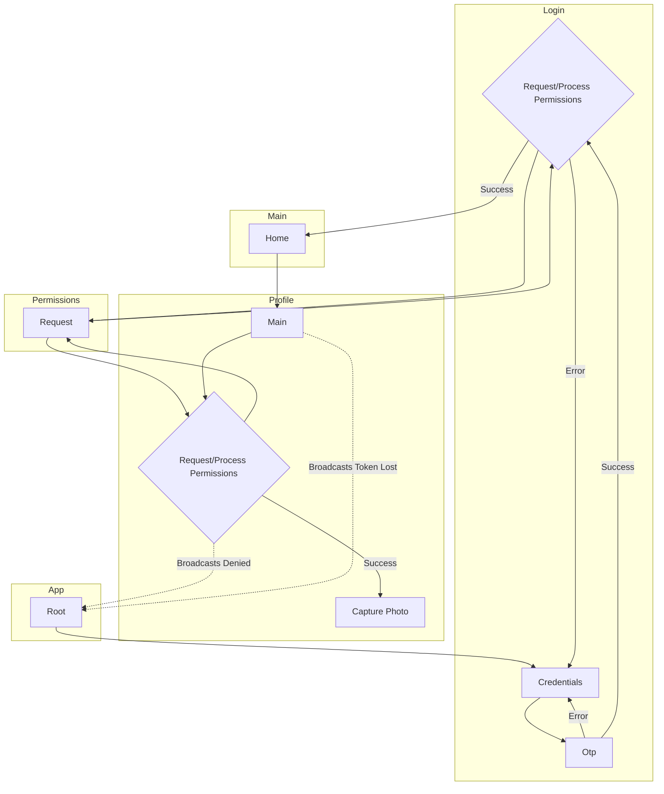

```mermaid
graph TD
    A3 --> B1
    B1 --> A3
    A3 --> |Success| C1
    D2 --> B1
    B1 --> D2
    C1 --> D1
    O1 --> A1
    D2 -.-> |Broadcasts Denied| O1
    D1 -.-> |Broadcasts Token Lost| O1
    subgraph Profile
    D1[Main] --> D2{Request/Process Permissions}
    D2 --> |Success| D3[Capture Photo]
    end
    subgraph Main
    C1[Home]
    end
    subgraph Permissions
    B1[Request]
    end
    subgraph Login
    A1[Credentials]
    A1 --> A2[Otp]
    A2 --> |Error| A1
    A2 --> |Success| A3
    A3 --> |Error| A1
    A3{Request/Process Permissions}
    end
    subgraph App
    O1[Root]
    end
```
  
